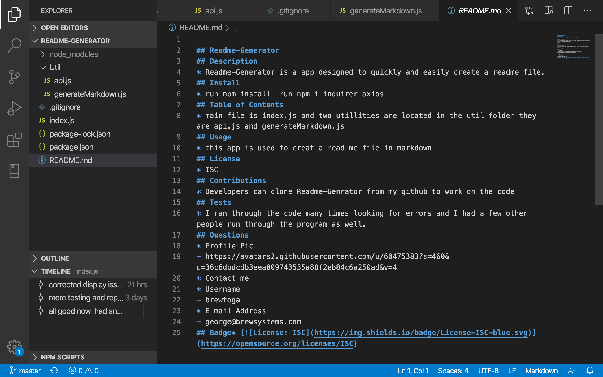

## Readme Generator
## Table of Contents
* [Description](#Description)
* [Installation](#Install)
* [Usage](#Usage)
* [Tests](#Tests)
* [Github](#Github)
* [Contact](#Email)
## Description
* Quickly provides a goood readme markdown file with a table of contents
## Install
* Run in node
* Click Image below to watch an instatllation video.

## Usage
* simple download and run in node
## Contributions
* Clone from github
## Tests
* User input
## Questions
* Profile Pic
- https://avatars2.githubusercontent.com/u/60475383?s=460&u=36c6dbdcdb3eea009743535a88f2eb84c6a250ad&v=4
## Issues
* Contact me
## Github Username
- brewtoga
## Email
- george@george.com
## License
* ISC
## Badge* 